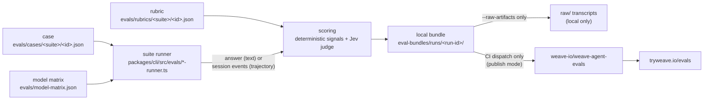

# Evals Overview

Read this page first. It explains what Weave's agent evals are for, how a case becomes a score, and the commands most people need. [Agent Evals](agent-evals.md) is the detailed reference; this page links into it rather than repeating it.

## What evals are for

Evals measure whether a prompt or agent change helped. Each case gives one agent (Loom, Tapestry, Shuttle, Spindle, Pattern, Weft or Warp) a realistic task and scores what it does. A deterministic check or an LLM judge does the scoring. You run the same cases before and after a change, with repeats, and `eval compare` tells you whether any difference is bigger than the noise. The evals are for measurement only. Nothing tunes prompts automatically.

## How a case becomes a score



- **Case** (`evals/cases/<suite>/<case-id>.json`). The scenario, the agents and models it allows, and the expected outcome. Omitting `allowed_models` means the case runs on every default and dev model.
- **Rubric** (`evals/rubrics/<suite>/<case-id>.json`). Has the same id as its case. It sets the weights, whether the case is `required`, and reviewer notes that the judge reads.
- **Fixtures** (`evals/fixtures/`). Small projects that trajectory cases copy into a sandbox, plus hidden `*.verifier` directories that check the agent's work afterwards.
- **Model matrix** (`evals/model-matrix.json`). The closed set of models. `default: true` models make up a full run, and the `dev: true` models (at most two) make up the cheap development subset.
- **Runner**. There is one runner per suite (`<suite>-runner.ts`). A text case makes one chat completion through OpenRouter. A trajectory case runs a real OpenCode session in a Podman sandbox.
- **Report**. Each run writes a sanitized bundle to `eval-bundles/runs/<sha7>-<date>-<NNN>/` (gitignored), including `public-report.json`, `public-report.md`, the per-suite `score-<suite>.json` files and a provenance manifest of prompt hashes. It also prints a run report on stdout.
- **Publish** (optional). Only when `WEAVE_EVAL_PUBLISH_MODE=publish` and a results-repo token are set, which in practice means the CI workflow. The bundle is then pushed to `weave-io/weave-agent-evals`, and [tryweave.io/evals](https://tryweave.io/evals) reads it from there. See [Eval Sanitization and Publish Pipeline](eval-sanitization-and-publish-pipeline.md).

## The suites

There are eight suites. Each has text cases, and three of them also have trajectory cases. "Judge" below means the Jev judge described in the next section. "Deterministic" means the runner extracts signals from the answer with fixed rules.

| Suite (`--agent` alias) | Cases | What it checks | How it is scored |
| --- | --- | --- | --- |
| `loom-routing` (`loom`) | 15 text, 3 trajectory | Loom picks the right agent or category shuttle for a request | Routing is deterministic. The judge scores rationale, which only adds weight |
| `tapestry-execution` (`tapestry`) | 4 text, 2 trajectory | Tapestry executes a plan step, delegates, and accepts or rejects a specialist's report | 1 case judged, 1 delegation chain judged, 2 `judgment` cases deterministic |
| `tapestry-category-routing` (`tapestry`) | 10 text | Tapestry routes work to the right `shuttle-<category>` | Routing is deterministic and graded. Required cases must also clear the judge's rationale gate (0.7) |
| `shuttle-execution` (`shuttle`) | 3 text, 1 trajectory | Shuttle's completion report is honest: task intake, files, commands, what it could not verify | 2 judged, 1 `judgment` case deterministic |
| `spindle-tools` (`spindle`) | 2 text | Spindle's research answer cites sources, separates facts from interpretation, and states confidence | Judged |
| `pattern-planning` (`pattern`) | 4 text | Pattern's plan has scope, file-backed tasks, order, per-task acceptance, and no invented commands | 2 judged, 2 `judgment` cases deterministic |
| `weft-review` (`weft`) | 4 text | Weft's review verdict, blocker count, and blockers that cite a file | 2 judged, 2 `judgment` cases deterministic |
| `warp-security` (`warp`) | 4 text | Warp's security verdict and evidence-backed findings | 2 judged, 2 `judgment` cases deterministic |

- **Text cases** (46) check what an agent *says* in a single answer, never what it does.
- **`judgment` cases** give the agent evidence but not the expected verdict. They come in pairs, one where the agent should act and one where it should not, so a prompt cannot pass them by leaning one way. See [Judgment cases](../evals/README.md#judgment-cases-judgment-tag).
- **Trajectory cases** (6, `expected_outcome.kind: "harness_trajectory"`) run a real harness session and are scored deterministically from its events: who it delegated to, which commands ran after the last edit, whether sub-agents ran in parallel, and whether a hidden verifier passes. Three of them stand in for the delegation, parallel-execution and environment-awareness problems found in the [September 2026 session audit](artifacts/session-audit-2026-09.md). See [Harness trajectory evals](agent-evals.md#harness-trajectory-evals).

**Pass rule.** Every case is scored on four dimensions from 0 to 1: routing, delegation, execution and rationale. Dimensions that do not apply to the case are left out. A case passes when one of its applicable routing, delegation or execution dimensions reaches 0.95. A case that the rubric does not mark `required` can also pass on a weighted total of 0.5 or more. Rationale on its own only moves the weighted total. Category routing has its own gate, and a trajectory case that declares checks needs execution at 0.95. See [Scoring semantics](agent-evals.md#scoring-semantics).

## The judge: Jev

Every judge call goes to **TypeSafe Jev** (`typesafe/jev-1.13`, pinned to the dated version `typesafe/jev-1.13-20260917`). It is called through OpenRouter's decisions endpoint.

- **Why Jev.** Jev is a judging model, not a chat model, so it can never be one of the models being evaluated. A chat-model judge would end up grading its own answers once that model joined the matrix. Jev returns probabilities rather than prose, so nothing it says can leak into a published file, and it costs about $0.00001 per call.
- **What it sees.** For each dimension it judges, Jev receives the case's rubric (description, expectation, criteria and reviewer notes), the reference, and **the agent's actual answer, unaltered**. It answers one yes/no question per criterion plus an overall question. The verdict comes from the overall answer alone: it is a pass at 0.5 or above.
- **Recorded.** The judge's id and version are written into every bundle. `eval compare` refuses to compare runs scored by different judges, so changing the judge means starting a new baseline.
- **Known blind spots.** In the acceptance check, Jev passed two of the planted failures: a Weft rejection whose BLOCKER lines name no file, and a Pattern plan that invents a command. Deterministic signals partly cover both (`weft-review-traced-true-positive`, `pattern-plan-no-invented-commands`), but on the judged cases the verdict is still Jev's.
- **Evidence.** Jev was accepted on 28 of 30 labelled items, catching 10 of 12 fails: see the [judge acceptance check](artifacts/judge-bakeoff-2026-09-23.md). The questions, score mapping and how to change the judge are in [The judge](agent-evals.md#the-judge).

## Commands

All of these run from the repository root. Live runs need `OPENROUTER_API_KEY`. Add `--dry-run` to any `eval run` to check the suite, case and model names for free, with no key needed. Filters match exactly: `--agent` takes a suite id or alias, `--case` a case id, `--model` a matrix id.

**1. Iterate on the dev subset.** This runs every suite on the two `dev` models (currently `deepseek/deepseek-v4-flash-0731` and `openai/gpt-6-luna`), three times each:

```bash
bun packages/cli/src/main.ts eval run --models dev --repeat 3
```

Add `--agent <suite>` to narrow it down. A plain `eval run` with no `--models` runs the full default matrix, which is the setting for a baseline and not for a quick check. See [The development subset](agent-evals.md#the-development-subset---models-dev).

**2. Diagnose one case on one model.**

```bash
bun packages/cli/src/main.ts eval run --agent weft-review \
  --case weft-review-traced-true-positive \
  --model deepseek/deepseek-v4-flash-0731 --raw-artifacts
```

This prints the verdict, every applicable dimension with its score (`✗` marks a score below its bar), and the path to the raw transcript. Nothing is published. See [Diagnose one case](agent-evals.md#diagnose-one-case).

**3. Repeat cases (`--repeat N`, 1 to 20).** Each case runs N times per model, and the report shows a pass rate (`PASS 5/5`, `FLAKY 3/5`, `FAIL 0/5`) rather than a single verdict. The run costs N times as much. See [Repeat cases](agent-evals.md#repeat-cases---repeat-n).

**4. Measure a change with `eval compare`.** Run the same filters and the same `--repeat` on the commit before the change and on the commit with it, then compare the two runs:

```bash
bun packages/cli/src/main.ts eval compare <baseline-run-id> <candidate-run-id>
```

It reads only the two local bundles, so it makes no model calls and needs no key. For each suite and model it prints both pass rates, with 95% intervals, and a verdict:

- **IMPROVED** / **REGRESSED**: the difference passes Fisher's exact test after Holm adjustment across the rows (p < 0.05).
- **no detectable change**: the data cannot tell the two runs apart. It does *not* mean the runs are equal. With 25 attempts a side, a move from 60% to 80% usually goes undetected. The fix is a higher `--repeat` or more cases.
- **no detectable change: too few scored attempts**: nothing this small could ever reach significance. Re-run both with a higher `--repeat`.

It refuses runs that used different models, cases, repeat counts or judges, and it refuses dry runs. See [Measure a change](agent-evals.md#measure-a-change) and [Compare two runs](agent-evals.md#compare-two-runs-eval-compare).

**5. Trajectory cases.** These need Podman and the sandbox image. Build the image once, and again after pulling changes:

```bash
podman build -t weave-sandbox-opencode-default -f sandboxes/opencode/Containerfile sandboxes/opencode
TMPDIR=~/.cache/weave-trajectory-tmp \
  bun packages/cli/src/main.ts eval run --track trajectory --models dev --raw-artifacts
```

`--track text` runs only the text cases. On the dev subset, five of the six trajectory cases run on DeepSeek V4 Flash. `openai/gpt-6-luna` is in none of their `allowed_models`, and the Phase 1 case runs only on `openai/gpt-4o-mini`. Each session can take up to its `max_duration_seconds` (5 to 9 minutes). See [Run one track](agent-evals.md#run-one-track---track).

**6. Dispatch the CI workflow.** The workflow is manual only, and every dispatch publishes its results:

```bash
gh workflow run agent-evals.yml -f models=dev -f repeat=3
```

The inputs are `agent`, `model`, `models` (`default` or `dev`), `case`, `repeat` and `trajectory` (on by default). The workflow runs a text job and then a trajectory job. See [CI dispatch](agent-evals.md#ci-dispatch).

**Cost and time.**
- A live run of 16 answers on the dev subset, one case per judged suite with Jev judging, cost about $0.012 on 24 Sep 2026.
- The full default matrix took about 65 minutes on the 5 Sep 2026 run.
- The time and cost of `--models dev --repeat 3` have not been measured yet. [Spec 37](specs/37-spec-repository-foundation/37-tasks-repository-foundation.md) task 7.2 records them.
- Check your OpenRouter credits before a large run.

## Reading results

- **PASS / FAIL**: the case was scored. FAIL means the answer fell short of the rubric.
- **ERROR**: the case was *not* scored. The answer came back empty or truncated on every attempt, the request failed, or the judge could not answer. An errored case is never counted as a failure and is left out of pass rates. A suite with an errored case is never green, and the run exits 1. See [Errored cases](agent-evals.md#empty-and-truncated-answers-errored-cases).
- **Pass rate** = passed / (passed + failed), with errored attempts left out. It is `null` when every attempt errored.
- **A failure block** shows the weighted total against the pass mark, each applicable dimension against its bar (0.95 for routing, delegation and execution; 0.70 for rationale), a short `Why:` line, and the raw transcript path.
- **Raw transcripts** are written to `eval-bundles/runs/<run-id>/raw/` only with `--raw-artifacts`. They hold the prompt, the answer, the judge's rationale (which of its criteria fell below 0.5) and the runner's diagnostics, such as which required signals were missing. They stay local: CI rejects `--raw-artifacts`, and the sanitizer keeps them out of every published file.
- **Published history** is in `weave-io/weave-agent-evals`. See [Remote checks](agent-evals.md#remote-checks).

## Adding a case or a model

- **A model** takes one edit: add an entry to `evals/model-matrix.json`. Every case that omits `allowed_models`, and the CI dispatch allowlist, follow the matrix automatically. The trajectory cases are the exception: they pin their own `allowed_models`, so a new model runs on them only if you add it to each case that should run it. The trajectory job's allowlist follows those lists. See [Adding a model](agent-evals.md#adding-a-model).
- **A text case** needs a case JSON and a rubric JSON with the same id in one of the eight suites. It should assert only what is visible in the answer. Then run `bun test ./packages/cli/src/evals/__tests__` and `eval run --case <id> --dry-run`. The CI dispatch allowlist lists every case id, and `workflow-sync.test.ts` fails until you add the new one. See [Adding a New Case](../evals/README.md#adding-a-new-case).
- **A trajectory case** also needs a fixture under `evals/fixtures/`, and optionally a verifier. See [Verification-aware trajectory cases](agent-evals.md#verification-aware-trajectory-cases-spec-35) and [Spec 35](specs/35-spec-verification-trajectory-evals/35-spec-verification-trajectory-evals.md).

## Further reading

- [Agent Evals](agent-evals.md): the detailed reference, covering architecture, scoring, the judge, errored cases, the CLI, bundle schema, the CI model and past decisions.
- [`evals/README.md`](../evals/README.md): fixture schemas and per-suite authoring guidance.
- [Eval Sanitization and Publish Pipeline](eval-sanitization-and-publish-pipeline.md): what may be published, and how the website reads it.
- [Eval XSS Policy](eval-xss-policy.md): rendering rules for published reports.
- [Judge acceptance check](artifacts/judge-bakeoff-2026-09-23.md): how Jev was accepted.
- [Spec 37](specs/37-spec-repository-foundation/37-spec-repository-foundation.md): the goals and the finish line for the eval work.
- [Spec 33](specs/33-spec-harness-trajectory-evals/33-spec-harness-trajectory-evals.md) and [ADR 0008](adr/0008-harness-trajectory-evals.md): the trajectory track.
