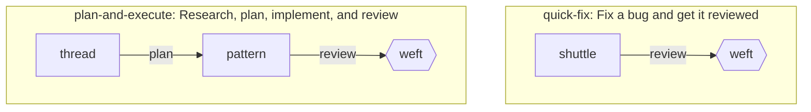
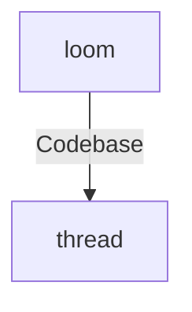

# Prompt Composition

Weave composes each agent's final prompt in the engine layer before handing the
agent to an adapter. The output of that composition step is an
`AgentDescriptor`: a normalized, harness-agnostic record containing the final
prompt text plus the other adapter-facing fields derived during composition.

**Related:** [ADR 0001: Prompt Composition Templates](adr/0001-prompt-composition-templates.md) · [Adapter Boundary](adapter-boundary.md) · [Config Loading](config-loading.md) · [Tool Policy Evaluation](tool-policy-evaluation.md) · [Agent Guide / neverthrow rules](../AGENTS.md) · [Context Glossary](../CONTEXT.md)

---

## Purpose

Prompt composition is engine-owned because it is a pure interpretation of Weave
config, not a harness concern.

The engine is responsible for:

- loading the configured prompt source (Markdown format)
- rendering `prompt` / `prompt_file` and `prompt_append` as Mustache Prompt Templates
- generating delegation guidance from the agent's `triggers` config
- appending fallback delegation guidance and `prompt_append` text in composition order
- evaluating abstract tool policy into `EffectiveToolPolicy`
- returning a normalized descriptor adapters can consume directly

Adapters are responsible for materializing that descriptor inside a concrete
harness. They do not re-implement prompt composition rules.

This boundary follows [Adapter Boundary](adapter-boundary.md): the engine owns
prompt composition because the rules are reusable, deterministic, and free of
harness-specific assumptions.

### Builtin prompt files

Builtin prompt files (shipped in `packages/config/prompts/`) are Markdown
documents. They are product-level defaults, not Weave-repo policy carriers, and
they should remain skill-agnostic unless and until skill content becomes part of
the composed prompt contract.
They should:

- state the agent's abstract behavioral boundaries (e.g. read-only, planning-only,
  review-only, no delegation) in human-readable terms; `toolPolicy.effective`
  is available to templates, but prompts should not rely on permission metadata
  alone to explain behavior
- include compact output-shape guidance where handoff format matters (e.g.
  asking for concise top-level `APPROVE` / `BLOCK` review verdict wording)
- use Template Context fields only where they improve prompt clarity; do not add
  artificial tags just to prove templating
- place generated delegation guidance with `{{{delegation.section}}}` when the
  prompt should control where routing guidance appears

The Composer (engine) owns the delegation inventory. Prompt templates may decide
where to render that inventory, but they should not hand-copy target lists that
could diverge from config.

---

## `AgentDescriptor`

`composeAgentDescriptor()` returns this descriptor shape:

```ts
interface AgentDescriptor {
  name: string;
  description?: string;
  composedPrompt: string;
  models: string[];
  mode: "primary" | "subagent" | "all";
  temperature?: number;
  effectiveToolPolicy: EffectiveToolPolicy;
  rawToolPolicy: ToolPolicy | undefined;
  delegationTargets: DelegationTarget[];
  skills: string[];
}

interface DelegationTarget {
  name: string;
  description?: string;
  triggers: DelegationTrigger[];
}
```

### Field meanings

| Field | Meaning |
| --- | --- |
| `name` | Logical agent name being composed. |
| `description` | Optional agent description passed through from config. |
| `composedPrompt` | Final prompt text after prompt loading, delegation section formatting, and `prompt_append` composition. |
| `models` | Ordered model preference list from config, defaulting to `[]`. |
| `mode` | Adapter-facing mode hint, defaulting to `"subagent"` when omitted. |
| `temperature` | Optional temperature passed through unchanged. |
| `effectiveToolPolicy` | Fully-resolved abstract tool policy computed by `evaluateEffectiveToolPolicy()`. See [Tool Policy Evaluation](tool-policy-evaluation.md). |
| `rawToolPolicy` | Original declared `tool_policy`, or `undefined` when absent. |
| `delegationTargets` | Filtered list of eligible delegation targets, used both for prompt composition and adapter-side routing if needed. |
| `skills` | Declared skill names passed through unchanged as a future composition input. |

---

## Composition Pipeline

`composeAgentDescriptor(agentName, agentConfig, config, allAgents)` runs this
pipeline:

1. **Build delegation targets**
   - Delegation targets are computed first from `allAgents`.
   - If `agentConfig.tool_policy?.delegate !== "allow"`, the list is empty.

2. **Load prompt source**
   - If `agentConfig.prompt` is defined, use it directly.
   - Otherwise read `agentConfig.prompt_file` from disk.
   - If neither exists, return `PromptSourceMissingError`.
   - If file reading fails, return `PromptFileReadError`.

3. **Build Template Context**
   - The engine projects config and computed routing data into a bounded Template
     Context.
   - The context includes public agent identity, optional category identity,
     effective tool policy, and generated delegation fields.

4. **Render prompt templates**
   - The primary prompt source is rendered as Mustache.
   - If `prompt_append` is present, it is also rendered as Mustache using the
     same Template Context.

5. **Insert fallback delegation guidance**
   - If eligible delegation targets exist and the primary prompt source does not
     contain a real `delegation.*` Mustache reference, the engine inserts
     `delegation.section` after the rendered primary source and before rendered
     `prompt_append`.
   - `prompt_append` may render `delegation.*`, but it does not suppress fallback.

6. **Resolve tool policy**
   - The engine calls `evaluateEffectiveToolPolicy(agentConfig.tool_policy)`.
   - This produces a complete `EffectiveToolPolicy` with all five abstract
     capabilities resolved. See [Tool Policy Evaluation](tool-policy-evaluation.md).

7. **Assemble the descriptor**
   - The engine returns an `AgentDescriptor` containing the composed prompt,
     delegation targets, resolved policy, raw policy, passthrough metadata, and
     declared skills.

The implementation lives in
[`packages/engine/src/compose.ts`](../packages/engine/src/compose.ts).

---

## Delegation Filtering Rules

Delegation targets are included only when delegation is explicitly allowed for
the composing agent.

Current filtering rules:

1. **Exclude self**
   - An agent cannot delegate to itself.

2. **Exclude disabled agents**
   - Any agent listed in `config.disabled.agents` is removed.

3. **Exclude `mode: "primary"` agents**
   - Primary agents are not treated as delegation targets.

4. **Exclude shared/category shuttle targets when composing shuttle agents**
   - If the target name starts with `shuttle-` and the composing agent is either
     `shuttle` or already a `shuttle-*` agent, that target is excluded.
   - This prevents the shared shuttle agent and generated category shuttles from
     advertising one another as delegation targets.

These rules are engine-owned because they define normalized delegation topology,
not harness behavior.

---

## Prompt Templates

Agent `prompt`, `prompt_file`, and `prompt_append` values are Prompt Templates.
The engine renders them with the canonical `mustache` package behind a Weave
wrapper before adapters receive the `Composed Prompt`.

Supported first-slice Mustache features:

- escaped variables with `{{path}}`
- unescaped variables with `{{{path}}}` for Markdown-rich values
- dotted names such as `{{agent.name}}`
- sections and inverted sections for conditionals and list iteration
- comments
- current item rendering with `{{.}}`

Unsupported features fail composition with typed template errors:

- partials such as `{{> footer}}`
- delimiter changes such as `{{=<% %>=}}`
- lambdas, helpers, function calls, executable behavior, filesystem access, or
  environment access

Use a backslash to render a literal tag opening. For example, `\{{agent.name}}`
renders as `{{agent.name}}` and does not count as a template reference.

Double braces use canonical Mustache HTML escaping. Markdown-rich values such as
`delegation.section` and `delegation.mermaid` should be rendered with triple
braces:

```md
{{{delegation.section}}}
```

---

## Template Context

The Template Context is a bounded public projection, not raw `WeaveConfig` or
`AgentConfig`. Schema-aware strict rendering uses an explicit allowed-path list
so typos fail while allowed optional paths may be absent and falsey.

First-slice context fields:

```ts
interface AgentPromptTemplateContext {
  agent: {
    name: string;
    description?: string;
    mode: "primary" | "subagent" | "all";
    skills: string[];
    isCategory: boolean;
  };
  category?: {
    name: string;
    description?: string;
  };
  toolPolicy: {
    effective: {
      read: "allow" | "deny" | "ask";
      write: "allow" | "deny" | "ask";
      execute: "allow" | "deny" | "ask";
      delegate: "allow" | "deny" | "ask";
      network: "allow" | "deny" | "ask";
    };
  };
  delegation: {
    section?: string;
    mermaid?: string;
    targets: Array<{
      name: string;
      description?: string;
      domains: string[];
      triggers: Array<{ domain: string; trigger: string }>;
    }>;
  };
}
```

`agent.isCategory` is true only for agents generated from `category` blocks, such
as `shuttle-frontend`. For non-category agents, `category` is omitted and can be
tested with normal Mustache sections:

```md
{{#category}}
This is the {{name}} category shuttle.
{{/category}}
```

Inside list sections, standard Mustache context-stack semantics apply. For
example, inside `{{#delegation.targets}}`, `{{name}}` resolves to the current
target name. Scalar lists such as `agent.skills` can render items with `{{.}}`.

---

## Delegation Diagram

When at least one delegation target survives filtering, the engine generates a
Delegation Diagram plus compact bullets.

### Workflow-sequence diagram (default when workflows are defined)

When the config includes workflow definitions, the engine generates a
**workflow-sequence diagram** instead of the flat star. Each workflow is rendered
as a labelled `subgraph`. Steps are connected in order (step[i] → step[i+1])
with the step name as the edge label. Gate steps use Mermaid hexagon `{{"agent"}}`
syntax; autonomous/interactive steps use rectangle `["agent"]` syntax.

Only workflows where at least one step's agent matches a delegation target (or
the current agent itself) are included. This filters out irrelevant workflows.

Node IDs use a prefix derived from the workflow name: the first character of each
hyphen/space-separated word, uppercased, followed by `_` and the agent name
(e.g. `quick-fix` → `QF_shuttle`, `tapestry-execution` → `TE_weft`).

Example for an agent with `quick-fix` and `plan-and-execute` workflows:

````md

````

### Flat star fallback (no workflows)

When no workflows are defined, the diagram falls back to a current-agent star:
the current agent (`A0`) points to each eligible delegation target (`A1`, `A2`, …).
Edge labels use deduplicated trigger domains when available.

`delegation.mermaid` contains only the Mermaid code block content (no code fence).
It uses stable synthetic node IDs and escaped labels so arbitrary agent names and
trigger labels do not break Mermaid parsing.

`delegation.section` contains the canonical Markdown section: heading, Mermaid
diagram, and compact bullets:

````md
## Delegation



- thread — Fast codebase exploration
  - Codebase: Search and summarize source files
````

If a target has no description, only the agent name is shown. If a target has no
triggers, only the top-level bullet is emitted. If there are no eligible targets,
`delegation.targets` is empty and `delegation.section` / `delegation.mermaid` are
omitted.

### Mermaid hexagon syntax and Mustache compatibility

Mermaid hexagon nodes use `{{"agent"}}` syntax (double braces with quoted label).
This is distinct from Mustache `{{variable}}` syntax because the content starts
with a quote character. The engine's post-render unresolved-tag check uses a
precise regex that only matches Mustache-style identifiers (letters, digits, dots,
underscores, hyphens), so Mermaid hexagon syntax does not trigger false positives.

---

## Composition Order

Final prompt text is assembled in this order:

1. rendered primary prompt source (`prompt` or `prompt_file`)
2. fallback `delegation.section`, only when the primary source has no real
   `delegation.*` reference and delegation targets exist
3. rendered `prompt_append`, when present

A real `delegation.*` reference means an actual parsed Mustache variable,
section, or inverted-section token. Escaped literal tags and comments do not
suppress fallback.

Example custom placement:

```md
You are {{agent.name}}.

{{{delegation.section}}}
```

Because the primary source references `delegation.section`, the engine does not
append fallback delegation a second time.

---

## Template Errors

Template failures are reported as `ComposeError` with a `PromptTemplateError`
variant and a nested reason such as malformed syntax, unsupported tag, unknown
path, unsafe path, function value, section mismatch, or unresolved rendered tag.

Template errors include:

- `agentName`
- `sourceKind`: `prompt`, `prompt_file`, or `prompt_append`
- `promptFilePath` when `sourceKind` is `prompt_file`
- line/column where available
- the offending tag/path when available

`prompt_append` errors report line/column in the merged append text. The first
slice does not preserve base-vs-category append fragment provenance.

Because rendering uses schema-aware strict paths:

- `{{agent.name}}` succeeds
- `{{agnt.name}}` fails as an unknown path
- `{{#category}}...{{/category}}` is valid and falsey for non-category agents
- `{{agent.__proto__}}` and `{{constructor.name}}` fail as unsafe paths

Rendered output is also checked for unresolved unescaped Mustache tags. Escaped
literal tags produced from `\{{...}}` are allowed.

---

## Compatibility with Existing Prompts

Existing static prompts remain valid because every prompt source is rendered as a
Prompt Template, but sources without Mustache tags render to the same text.

Existing custom prompts that do not reference `delegation.*` continue to receive
generated fallback delegation when their agent can delegate. To control placement
manually, add a real `delegation.*` reference such as `{{{delegation.section}}}`
to the primary prompt source.

Workflow step prompt interpolation is conceptually aligned with Prompt Templates
but not implemented in this slice. Future workflow rendering should reuse the
same renderer with a workflow-specific Template Context.

---

## Skills Extension Point

`skills` is currently a passthrough field on `AgentDescriptor`.

The current composition phase does **not** resolve, load, or filter skills. It
simply copies `agentConfig.skills ?? []` onto the descriptor so downstream code
has a stable place to read declared skill intent.

This is an intentional extension point for issue #12. The planned direction is:

- skill discovery/loading remains adapter-owned
- skill matching/filtering remains engine-owned
- resolved skills will become an additional composition phase before delegation

That future work must continue to respect the ownership rules in
[Adapter Boundary](adapter-boundary.md).

---

## Adapter Consumption

Adapters receive the composed descriptor via
`HarnessAdapter.spawnSubagent(descriptor)`.

They are expected to consume these fields as follows:

- `descriptor.composedPrompt` — final prompt string to write into the harness
- `descriptor.effectiveToolPolicy` — resolved abstract capability policy for
  concrete tool-permission mapping
- `descriptor.rawToolPolicy` — original declared policy if the harness needs the
  raw values
- `descriptor.models` — ordered model intent for adapter-side model selection
- `descriptor.delegationTargets` — normalized routing metadata if the harness
  needs additional delegation setup

`RunAgentEffect` also carries the full `agentDescriptor` immediately before the
adapter spawn call, alongside `effectiveToolPolicy` and `rawToolPolicy`. See
[`packages/engine/src/run-agent-effects.ts`](../packages/engine/src/run-agent-effects.ts).

---

## Error Handling

Prompt composition follows the repository rule that fallible logic returns
`neverthrow` results rather than throwing expected errors. See the
[Agent Guide / neverthrow rules](../AGENTS.md).

`composeAgentDescriptor()` returns:

```ts
ResultAsync<AgentDescriptor, ComposeError>
```

`ComposeError` includes prompt-source, prompt-file, and prompt-template failure
variants:

```ts
type ComposeError =
  | {
      type: "PromptSourceMissingError";
      agentName: string;
      message: string;
    }
  | {
      type: "PromptFileReadError";
      agentName: string;
      promptFilePath: string;
      message: string;
      fileErrorMessage: string;
    }
  | {
      type: "PromptTemplateError";
      agentName: string;
      sourceKind: "prompt" | "prompt_file" | "prompt_append";
      promptFilePath?: string;
      message: string;
      reason:
        | { type: "MalformedSyntax"; line: number; column: number }
        | { type: "UnsupportedTag"; tag: string; line: number; column: number }
        | { type: "UnknownPath"; path: string; line: number; column: number }
        | { type: "UnsafePath"; path: string; line: number; column: number }
        | { type: "FunctionValue"; path: string; line: number; column: number }
        | { type: "SectionMismatch"; line: number; column: number }
        | { type: "UnresolvedTag"; tag: string };
    };
```

### `PromptSourceMissingError`

Returned when an agent declares neither inline `prompt` nor `prompt_file`.

### `PromptFileReadError`

Returned when the configured prompt file cannot be read. The error includes the
logical `agentName`, the attempted `promptFilePath`, a human-readable `message`,
and `fileErrorMessage` — a serializable string extracted from the underlying
read failure (`cause instanceof Error ? cause.message : String(cause)`).

### `PromptTemplateError`

Returned when Mustache parsing, strict path validation, unsupported-feature
validation, rendering, or rendered-output checks fail. The error identifies the
logical source (`prompt`, `prompt_file`, or `prompt_append`) and maps library or
wrapper failures into a typed nested reason.

Because composition returns `ResultAsync`, callers can compose prompt loading
with the rest of the engine pipeline without `try/catch` control flow.

---

## Source Files

| File | Contents |
| --- | --- |
| [`packages/engine/src/compose.ts`](../packages/engine/src/compose.ts) | `AgentDescriptor`, `DelegationTarget`, `ComposeError`, `composeAgentDescriptor()` |
| `packages/engine/src/template-renderer.ts` | Mustache wrapper, parse/render helpers, reference extraction, unsupported-feature and unresolved-tag checks |
| `packages/engine/src/template-context.ts` | Agent prompt Template Context types, allowed paths, delegation projection, Mermaid and section generation |
| [`packages/engine/src/run-agent-effects.ts`](../packages/engine/src/run-agent-effects.ts) | `RunAgentEffect` carrying the composed descriptor |
| [`packages/engine/src/tool-policy.ts`](../packages/engine/src/tool-policy.ts) | `evaluateEffectiveToolPolicy()` and `EffectiveToolPolicy` |
