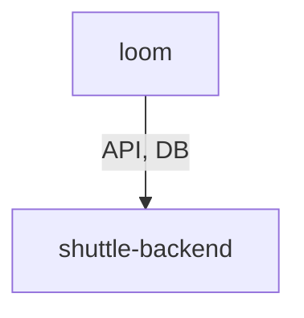

# Task 2 Proof Artifacts — Bounded Template Context and Delegation Guidance Generator

> **Amendment:** `delegation-section` and `delegation-mermaid` were removed from the engine after this proof was recorded. The fallback-append logic was also removed. The current supported pattern is `{{#delegation.targets}}` iteration in prompt templates. Sections 7, 8, and 9 below reflect the original implementation and are preserved for historical reference only.

## 1. Diff: `packages/engine/src/template-context.ts` (new file)

```diff
+++ b/packages/engine/src/template-context.ts
@@ -0,0 +1,310 @@
+/**
+ * template-context.ts
+ *
+ * Bounded Template Context builder for Weave prompt composition.
+ *
+ * Responsibilities:
+ * - Define `AgentPromptTemplateContext` — the shape passed to the template renderer
+ * - Define allowed-path metadata covering all safe template references
+ * - Build agent context projecting only safe, non-raw fields
+ * - Build category context for generated category shuttle agents only
+ * - Project resolved effective tool policy (no raw policy exposure)
+ * - Project delegation targets with deduplicated domains and trigger details
+ * - Generate deterministic Mermaid `flowchart TD` delegation diagrams
+ * - Generate canonical `delegation-section` Markdown
+ * - Omit `delegation-section` and `delegation-mermaid` when no targets exist
+ */
+
+// ... (full file: 310 lines)
+// Key exports:
+// - ALLOWED_TEMPLATE_PATHS: Set<string> — 28 allowed paths
+// - AgentPromptTemplateContext interface
+// - TemplateContextError type
+// - TemplateContextInput interface
+// - buildTemplateContext(input): Result<AgentPromptTemplateContext, TemplateContextError>
```

## 2. Diff: `packages/engine/src/index.ts` (updated exports)

```diff
+export type {
+  AgentPromptTemplateContext,
+  CategoryContextEntry,
+  AgentContextEntry,
+  DelegationContextEntry,
+  DelegationTargetContextEntry,
+  TemplateContextError,
+  TemplateContextInput,
+  ToolPolicyContextEntry,
+  CategoryInput,
+} from "./template-context.js";
+export {
+  ALLOWED_TEMPLATE_PATHS,
+  buildTemplateContext,
+} from "./template-context.js";
```

Note: `generateMermaidDiagram`, `generateDelegationSection`, `projectDelegationTarget`, `escapeMermaidLabel`, `mermaidNodeId` are all internal (not exported from index.ts).

## 3. Typecheck Output: `bun run --filter '@weave/engine' typecheck`

```
@weave/engine typecheck: Exited with code 0
```

✅ Zero TypeScript errors. All exported types compile cleanly.

## 4. Test Output: `bun run --filter '@weave/engine' test`

```
@weave/engine test:  460 pass
@weave/engine test:  0 fail
@weave/engine test:  1327 expect() calls
@weave/engine test: Ran 460 tests across 13 files. [66.00ms]
@weave/engine test: Exited with code 0
```

64 new tests added in `template-context.test.ts` (460 total, up from 396 after Task 1).

## 5. No Raw Config/Model/Temperature/Path Exposure

### Confirmed absent from `AgentPromptTemplateContext`:

| Field | Present? | Notes |
|---|---|---|
| `models` | ❌ No | Raw model list never projected |
| `temperature` | ❌ No | Raw temperature never projected |
| `prompt_file` | ❌ No | Prompt file path never projected |
| `rawToolPolicy` | ❌ No | Only `toolPolicy.effective` is projected |
| `config` | ❌ No | Full WeaveConfig never projected |
| `prompt` | ❌ No | Raw prompt source never projected |
| `prompt_append` | ❌ No | Raw prompt_append never projected |

### What IS projected:

| Path | Source |
|---|---|
| `agent.name` | `TemplateContextInput.agentName` |
| `agent.description` | `TemplateContextInput.description` (optional) |
| `agent.mode` | `TemplateContextInput.mode` |
| `agent.skills` | `TemplateContextInput.skills` |
| `agent.isCategory` | Derived: `category !== undefined` |
| `category.name` | `TemplateContextInput.category.name` (only for category shuttles) |
| `category.description` | `TemplateContextInput.category.description` (optional) |
| `toolPolicy.effective.*` | `TemplateContextInput.effectiveToolPolicy` (5 resolved values) |
| `delegation.targets` | Projected from `TemplateContextInput.delegationTargets` |
| ~~`delegation-mermaid`~~ | ~~Generated (only when targets exist)~~ — **REMOVED** |
| ~~`delegation-section`~~ | ~~Generated (only when targets exist)~~ — **REMOVED** |

## 6. Allowed-Path Metadata

> **Amendment:** `delegation-section` and `delegation-mermaid` were removed from `ALLOWED_TEMPLATE_PATHS` when those fields were removed from the engine.

`ALLOWED_TEMPLATE_PATHS` (original, 28 paths — now reduced by 2):

```
agent, agent.name, agent.description, agent.mode, agent.skills, agent.isCategory,
category, category.name, category.description,
toolPolicy, toolPolicy.effective,
toolPolicy.effective.read, toolPolicy.effective.write, toolPolicy.effective.execute,
toolPolicy.effective.delegate, toolPolicy.effective.network,
delegation, delegation.targets,
[delegation-section REMOVED], [delegation-mermaid REMOVED],
delegation.targets.name, delegation.targets.description, delegation.targets.domains,
delegation.targets.triggers, delegation.targets.triggers.domain,
delegation.targets.triggers.trigger,
.
```

## 7. Mermaid Generation Verification *(historical — feature removed)*

> **Amendment:** `delegation-mermaid` was removed from the engine. The following is preserved for historical reference only.

Example output for agent `loom` with two targets:

```
flowchart TD
    A0["loom"]
    A1["shuttle-backend"]
    A2["shuttle-frontend"]
    A0 -->|"API, DB"| A1
    A0 -->|"UI"| A2
```

- ✅ Stable node IDs: `A0` = current agent, `A1`/`A2`/... = targets in order
- ✅ Labels wrapped in double quotes
- ✅ `"` inside labels escaped as `#quot;`
- ✅ Domain edge labels deduplicated across triggers
- ✅ Unlabelled edge when target has no triggers
- ✅ Deterministic: same input → same output

## 8. Delegation Section Markdown Verification *(historical — feature removed)*

> **Amendment:** `delegation-section` was removed from the engine. The following is preserved for historical reference only.

Example `delegation-section` for agent `loom` with one target:

```markdown
## Delegation



- shuttle-backend: Backend specialist
  - API: REST endpoint changes
  - DB: Schema migrations
```

- ✅ Starts with `## Delegation`
- ✅ Contains `\`\`\`mermaid` code block
- ✅ Compact bullets with optional description
- ✅ Nested trigger lines indented with `  - `

## 9. No-Target Omission Verification *(historical — feature removed)*

> **Amendment:** `delegation-section` and `delegation-mermaid` were removed entirely. The omission behaviour described below no longer applies.

When `delegationTargets = []`:
- `delegation.targets` → `[]` (always present — still true)
- ~~`delegation-mermaid` → `undefined` (omitted)~~ — field removed
- ~~`delegation-section` → `undefined` (omitted)~~ — field removed

## 10. Renderer Internals Not Exported

The following internal functions are NOT exported from `packages/engine/src/index.ts`:
- `generateMermaidDiagram`
- `generateDelegationSection`
- `projectDelegationTarget`
- `escapeMermaidLabel`
- `mermaidNodeId`

Only the public API is exported: `AgentPromptTemplateContext`, `TemplateContextError`, `TemplateContextInput`, `ALLOWED_TEMPLATE_PATHS`, `buildTemplateContext`, and supporting interface types.
