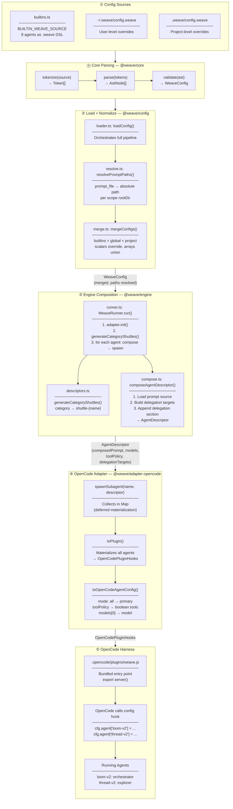
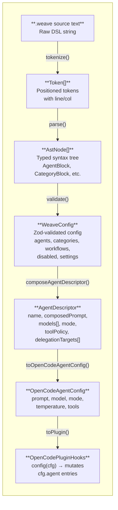

# OpenCode Spike — Architecture Mapping

How the working OpenCode spike maps to the [System Architecture](../system-architecture.md). Each layer shows the concrete files, functions, and data shapes involved.

**Related:** [System Architecture](../system-architecture.md) · [Adapter Boundary](../adapter-boundary.md) · [Config Loading](../config-loading.md)

---

## End-to-End Flow

This diagram traces a single request path: from `.weave` source text all the way to a running OpenCode agent.



---

## Data Shapes at Each Boundary



---

## Layer Detail: What Each Component Owns

### ⓪ Core Parsing (`@weave/core`)

The foundation. Every config source — builtins, global, project — passes through this pipeline.

```
parseConfig(source: string): Result<WeaveConfig, ConfigError[]>
```

| Stage | File | Input → Output |
|-------|------|----------------|
| Tokenize | `lexer.ts` | `string` → `Token[]` |
| Parse | `parser.ts` | `Token[]` → `AstNode[]` |
| Validate | `validate.ts` | `AstNode[]` → `WeaveConfig` (via Zod) |

Short-circuits on first failure. All errors carry line/column positions.

---

### ① Config Sources

Three layers, all parsed through the same core pipeline:

| Source | File | Scope |
|--------|------|-------|
| Built-in agents | `config/builtins.ts` | Lowest priority — defaults for 8 agents |
| Global config | `~/.weave/config.weave` | User-level — shared across projects |
| Project config | `.weave/config.weave` | Highest priority — project-specific |

Built-ins are declared as a `.weave` DSL string — same syntax users write. No separate code path.

---

### ② Load + Normalize (`@weave/config`)

Orchestrated by `loadConfig()`:

```
getBuiltinConfig()          → WeaveConfig (8 agents)
discoverAndParse()          → DiscoveredConfig[] (0-2 entries)
resolvePromptPaths(each)    → prompt_file → absolute path
mergeConfigs(all layers)    → single WeaveConfig
```

**Merge rules:**
- Scalars: last-defined wins
- Objects: recursive deep-merge
- Arrays: union-merge (override entries first, then base)

---

### ③ Engine Composition (`@weave/engine`)

`WeaveRunner.run()` orchestrates:

1. **Init** — `adapter.init()`
2. **Generate shuttles** — `generateCategoryShuttles(config)` → `shuttle-{name}` agents from categories
3. **Compose each agent** — `composeAgentDescriptor()` produces:

```typescript
interface AgentDescriptor {
  name: string
  composedPrompt: string        // prompt + delegation section + append
  models: string[]              // ordered preference
  mode: "primary" | "subagent" | "all"
  temperature?: number
  toolPolicy: ToolPolicy
  delegationTargets: DelegationTarget[]
}
```

4. **Materialize** — `adapter.spawnSubagent(name, descriptor)` for each

---

### ④ OpenCode Adapter

**Deferred materialization pattern:**

```
spawnSubagent()  →  collects in Map (no harness calls yet)
toPlugin()       →  materializes all at once as OpenCodePluginHooks
```

**Translation rules:**

| Weave | OpenCode |
|-------|----------|
| `mode: "all"` | `"primary"` (no `all` in OpenCode) |
| `toolPolicy.read: "allow"` | `tools.read = true` |
| `toolPolicy.read: "deny"` | `tools.read = false` |
| `toolPolicy.delegate: "allow"` | _(ignored — OpenCode has native delegation)_ |
| `models[0]` | `model` (single string) |

---

### ⑤ Harness Entry (Spike-Specific)

```
spike-opencode-plugin.ts
  → loads project config (not full loadConfig — spike shortcut)
  → filters to loom + thread, renames to loom-v2 + thread-v2
  → WeaveRunner(config, adapter).run()
  → adapter.toPlugin()

spike-opencode-plugin-wrapper.ts
  → exports server() for OpenCode plugin discovery

bun run spike:opencode
  → bundles to .opencode/plugins/weave.js
  → OpenCode auto-discovers on startup
  → calls server() → config hook → agents materialized
```

---

## Spike vs. Full Architecture

What the spike implements vs. what the architecture envisions:

| Architecture Component | Spike Status | Notes |
|----------------------|--------------|-------|
| Core DSL pipeline | ✅ Complete | Full lexer → parser → validator |
| Config discovery + merge | ✅ Complete | All three layers, full merge semantics |
| Prompt path resolution | ✅ Complete | Scope-aware absolute paths |
| Agent descriptor composition | ✅ Complete | Prompt + delegation + append |
| Category shuttle generation | ✅ Complete | Categories → shuttle-{name} agents |
| Model resolution | ⚠️ Partial | Pure helper exists, adapter integration pending |
| Skill resolution | ❌ Not started | Spec exists, no implementation |
| Workflow execution | ❌ Not started | Schema validates, no orchestration |
| Lifecycle policies | ❌ Not started | No abstract policy surface yet |
| OpenCode adapter | ⚠️ Spike | Agents work; hooks/skills deferred |
| Pi adapter | ⚠️ Spike | More complete than OpenCode; still spike-level |
| Claude Code adapter | ❌ Not started | Package exists but empty |
| Adapter ↔ Engine context flow | ⚠️ Partial | Adapter doesn't yet supply harness context back to engine |

The spike proves the **core data flow**: DSL → config → engine → adapter → harness. The remaining work is filling in the deferred composition features (skills, workflows, lifecycle) and maturing the bidirectional adapter ↔ engine context exchange.
